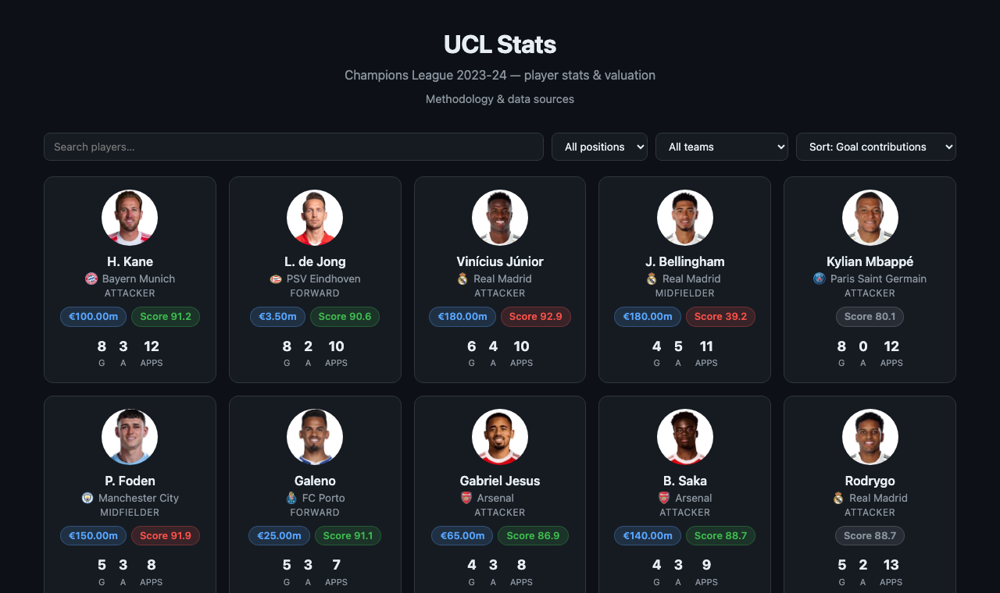

# UCL Stats

A Champions League (2023-24 season) player stats and valuation site: real stats, real market values, and a custom, transparent "value score" computed from performance data — with an honest write-up of how it works and where it's limited.



## Run it

```bash
cd backend
npm install
cp .env.example .env   # add your own API-Football key (see below)
npm start
```

Then open http://localhost:3000

Player and market-value data is already checked into the repo (`backend/data/*.json`), so the site works immediately — you only need an API key if you want to re-run the data refresh scripts yourself:

```bash
npm run refresh-stats       # re-fetch player/team stats from API-Football
npm run refresh-values      # re-scrape market values from Transfermarkt
```

Get a free API-Football key at [dashboard.api-football.com/register](https://dashboard.api-football.com/register) (100 requests/day, seasons 2022-2024 only on the free tier).

## How it works

- **Stats** come from the API-Football API, scoped to the 2023-24 Champions League group-stage teams (32 clubs, ~1100 players), prefetched and cached server-side so live traffic never touches the upstream API or its rate limit.
- **Market values** come from Transfermarkt (no official API exists), scraped into a checked-in snapshot. These reflect each club's *current* squad, not a true 2023-24 historical snapshot — see the site's About page for why, and what that means for coverage.
- **Value score** is a hand-built, fully transparent formula (documented on the About page) combining per-90 goal/assist production, an age curve, playing-time reliability, and appearances, normalized by percentile within each position group — with its own "implied value" for direct comparison against the real market value.

## Stack

Zero-build vanilla HTML/CSS/JS frontend, a minimal Express backend whose only job is to hold the API key and serve the pre-fetched data. No frameworks, no bundler.

## Current scope

Champions League 2023-24 group stage only — the most recent season covered by the free API tier. See commit history for build order.
